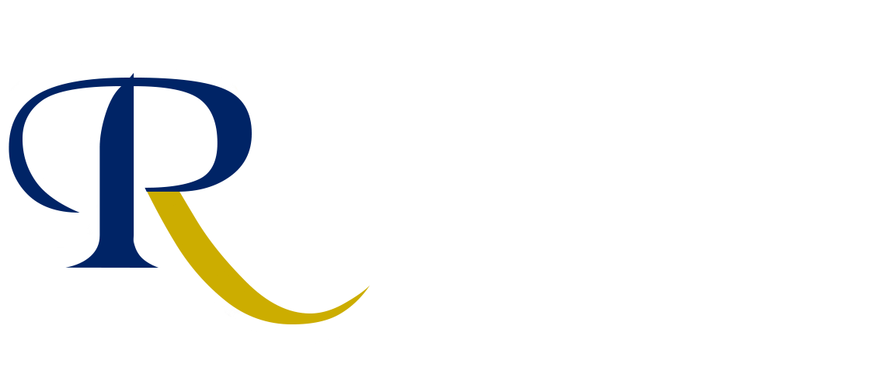
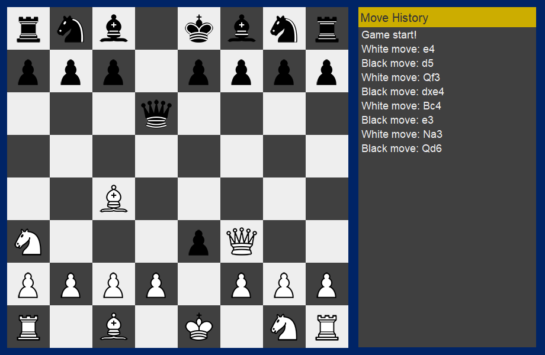

RoyalChess is a fully functional chess engine that allows you to challenge your chess friends locally. This engine was built using core Java, Swing GUI and jUnit for testing.

The GUI takes the current game state and displays it on the screen. To play, click and drag any piece into the desired tile to make a move. Moves follow normal chess rules.

### How to Run
Run the .jar file at RoyalChess/target, either by double clicking or by running
```
java -jar RoyalChess-1.3-SNAPSHOT.jar
```
on a terminal window.



### Known Bugs
+ None.


### Future Updates
+ Move timer.
+ Bigger choice of options (window resolution, mute/unmute, piece/board art and more).
+ Remote Play.
+ Player Account (saves elo, match history).
